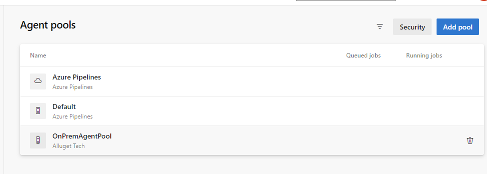
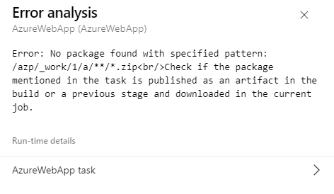

[English](README.md) | [簡体中文](README_CN.md)

# Intentions


* **This is a Azure Devops setup note written on 27 June 2024. Focus on create Azure Devops workflow from scratch.**

* Use [Azure DevOps](https://learn.microsoft.com/en-us/azure/devops/) to build and deploy.

* Build by self-hosted agent. (You can either purchase a [parallel job](https://learn.microsoft.com/en-us/azure/devops/pipelines/licensing/concurrent-jobs) or you can request a free tier.)

* Create and Deploy Orchard CMS to [Azure App Service](https://learn.microsoft.com/en-us/azure/app-service/overview) 

# **Prerequisites**

- An Azure account with an active subscription. [Create an account for free](https://azure.microsoft.com/free/?WT.mc_id=A261C142F).
- An Azure DevOps organization. [Create one for free](https://learn.microsoft.com/en-us/azure/devops/pipelines/get-started/pipelines-sign-up).

- A working Azure App Service app with code hosted on [GitHub](https://docs.github.com/en/get-started/quickstart/create-a-repo) or [Azure Repos](https://docs.github.com/en/get-started/quickstart/create-a-repo).
    

# Get started

## Open Azure DevOps

Visit the https://dev.azure.com/

First time, you have to register one organization. Click Open Azure DevOps.


Fill your info. 


 
Click, Continue


## Create a project in Azure DevOps


Enter project name and create project


Select Repo on left sidebar


Import https://github.com/kenszeapp/Orchardcore_Demo


 


Source code import done


## Create self-hosed Agent 

Click Project Settings on left-bottom corner, select Agents Pools


Click Add Pool 


Create new self-host agent pool 


## Create a Personal Access Token

Goto Devops project homepage, for example https://dev.azure.com/Alluget2024

Click the gear icon > Personal access token 


New Token 


Grant the Read & Manage for Agent Pools and create. 


Save the token string, it is used on next step.  


## Create and build the Dockerfile for self-hosted agent

Open a terminal in local machine. 

Create a new directory (recommended):
``` Bash
mkdir ~/devops/
```

Go to this new directory:
``` Bash
cd ~/devops/
```

Add file at ~/devops/azp-agent-linux.dockerfile with follow
 
``` Dockerfile
Copy
FROM ubuntu:22.04
ENV TARGETARCH="linux-x64"
# Also can be "linux-arm", "linux-arm64".

RUN apt update
RUN apt upgrade -y
RUN apt install -y curl git jq libicu70

WORKDIR /azp/

COPY ./start.sh ./
RUN chmod +x ./start.sh

# Create agent user and set up home directory
RUN useradd -m -d /home/agent agent
RUN chown -R agent:agent /azp /home/agent

USER agent
# Another option is to run the agent as root.
# ENV AGENT_ALLOW_RUNASROOT="true"

ENTRYPOINT [ "./start.sh" ]
```


Add file at ~/devops/start.sh with follow
```
#!/bin/bash
set -e

if [ -z "${AZP_URL}" ]; then
  echo 1>&2 "error: missing AZP_URL environment variable"
  exit 1
fi

if [ -z "${AZP_TOKEN_FILE}" ]; then
  if [ -z "${AZP_TOKEN}" ]; then
    echo 1>&2 "error: missing AZP_TOKEN environment variable"
    exit 1
  fi

  AZP_TOKEN_FILE="/azp/.token"
  echo -n "${AZP_TOKEN}" > "${AZP_TOKEN_FILE}"
fi

unset AZP_TOKEN

if [ -n "${AZP_WORK}" ]; then
  mkdir -p "${AZP_WORK}"
fi

cleanup() {
  trap "" EXIT

  if [ -e ./config.sh ]; then
    print_header "Cleanup. Removing Azure Pipelines agent..."

    # If the agent has some running jobs, the configuration removal process will fail.
    # So, give it some time to finish the job.
    while true; do
      ./config.sh remove --unattended --auth "PAT" --token $(cat "${AZP_TOKEN_FILE}") && break

      echo "Retrying in 30 seconds..."
      sleep 30
    done
  fi
}

print_header() {
  lightcyan="\033[1;36m"
  nocolor="\033[0m"
  echo -e "\n${lightcyan}$1${nocolor}\n"
}

# Let the agent ignore the token env variables
export VSO_AGENT_IGNORE="AZP_TOKEN,AZP_TOKEN_FILE"

print_header "1. Determining matching Azure Pipelines agent..."

echo ${AZP_AGENT_PACKAGE_LATEST_URL}

if [ -z "${AZP_AGENT_PACKAGE_LATEST_URL}" -o "${AZP_AGENT_PACKAGE_LATEST_URL}" == "null" ]; then
  echo 1>&2 "error: could not determine a matching Azure Pipelines agent"
  echo 1>&2 "check that account "${AZP_URL}" is correct and the token is valid for that account"
  exit 1
fi

print_header "2. Downloading and extracting Azure Pipelines agent..."

curl -LsS "${AZP_AGENT_PACKAGE_LATEST_URL}" | tar -xz & wait $!

source ./env.sh

trap "cleanup; exit 0" EXIT
trap "cleanup; exit 130" INT
trap "cleanup; exit 143" TERM

print_header "3. Configuring Azure Pipelines agent..."

./config.sh --unattended \
  --agent "${AZP_AGENT_NAME:-$(hostname)}" \
  --url "${AZP_URL}" \
  --auth "PAT" \
  --token $(cat "${AZP_TOKEN_FILE}") \
  --pool "${AZP_POOL:-Default}" \
  --work "${AZP_WORK:-_work}" \
  --replace \
  --acceptTeeEula & wait $!

print_header "4. Running Azure Pipelines agent..."

chmod +x ./run.sh

# To be aware of TERM and INT signals call ./run.sh
# Running it with the --once flag at the end will shut down the agent after the build is executed
./run.sh "$@" & wait $!
```


Add file at ~/devops/build-agent.env with follow

```
AZP_URL=https://dev.azure.com/Alluget2024
AZP_TOKEN=wswaqf7wuxitsoylgjxfehgu5qrvdtah4ms2vwj4eyzz7cnbl27q
AZP_POOL=OnPremAgentPool
AZP_AGENT_NAME=AgentInDocker
AZP_AGENT_PACKAGE_LATEST_URL=https://vstsagentpackage.azureedge.net/agent/3.241.0/vsts-agent-linux-x64-3.241.0.tar.gz
```


### Run the following command within that directory:

``` Bash
# Windows .\Dockerfile, Linux ./Dockerfile
docker build --tag "azp-agent:linux" --file ".\Dockerfile" .
```


### Run agent in Docker container.
```
docker run --env-file ".\build-agent.env" --name "azp-agent-linux" azp-agent:linux

```

If success, screen may like this 


## Verify self-hosted agent from Azure Devops

Now, new Agent Pool is appened.



Select the tab Agents, the On-Perm agent is ready.


# Create the Azure App Service instances

### Create App service 


### The Web app targets to .Net 8 with Linux. 

Create a staging machine first. 


# Create service connection 


Service connections play a pivotal role by facilitating integration with external services and platforms. For example, integrate external code repository. 

# Create Pipeline

### On left side bar, click Pipeline 


### Select 'Create pipeline'


### Select "Azure Repo Git"


### Edit and replace your setting in the pipeline yml 

* azureSubscription: 'Your devops service connection name'
* appName: 'App service name'
* resourceGroupName: 'your resource group name'  

```
variables:
  buildConfiguration: 'Release'

trigger:
- main

jobs:
- job: buildandtest
  pool:
    name: OnPremAgentPool
    demands:
      - agent.name -equals AgentInDocker
  steps:
    - task: DotNetCoreCLI@2
      displayName: 'Restore packages'
      inputs:
        command: 'restore'
        projects: '**/*.csproj'
    - task: DotNetCoreCLI@2
      displayName: 'Build project'
      inputs:
        command: 'build'
        projects: '**/*.csproj'
    - task: DotNetCoreCLI@2
      displayName: 'dotnet test'
      inputs:
        command: 'test'
        projects: '**/*.test/*.csproj'
        publishTestResults: true        

- job: deploystaging
  dependsOn: buildandtest
  condition: succeeded()
  pool:
    name: OnPremAgentPool
    demands:
      - agent.name -equals AgentInDocker
  steps:      
    - task: DotNetCoreCLI@2
      inputs:
        command: 'publish'
        publishWebProjects: true
    - task: AzureWebApp@1
      inputs:
        azureSubscription: 'az-devops-svc-conn'
        appType: 'webAppLinux'
        appName: 'orchardcore-demo-staging'
        deployToSlotOrASE: true
        resourceGroupName: 'oc-demo-devops-hk-rg'
        slotName: 'production'
        package: '$(System.DefaultWorkingDirectory)/**/*.zip'
        appSettings: '-ASPNETCORE_URLS http://*:8080'
     
     
```

### Testing the Build and test pipeline

**I add a Unit test project with 2 cases one success and one fail. Expected that will stop after the unitl test failure.**

After I pushed new branch and created pull request. 

Here is the code review screen. Click Approve and Complete.


### Click complete


Then the branch merge into main. 

### Pipeline is trigger and waiting approval 


 

### Click Approve 


It comes up expected result with one failure and stop proceed.  


# Setup Pull Request trigger Azure Pipeline  
**Next, I found that the pull request will not trigger pipeline by default. It requires add a validation policy.** 

### Goto > Repo > Branches


### select Branch ... policy 


### Add new Build Validation 


# Build -> test -> deploy automatically

I modify readme file then push and create pull-request again.

Next, goto Pipeline page. It shows pipeline is just running and trigger by PR automated. 

Click the pipeline, it has to approve a "pre-approval" what I try to add one more approval flow. 


### Pipeline done.


### Test Summary


### Check the Azure Web 


**Finished**


# Error notes

### You don't have the build-agent on the cloud or agent name incorrect.


That why I used the self-hosted agent.  

### pipeline error if the self host agent has not install .net SDK. 

##[error]Error: Unable to locate executable file: 'dotnet'. Please verify either the file path exists or the file can be found within a directory specified by the PATH environment variable. Also check the file mode to verify the file is executable.
##[error]Packages failed to restore

 

Seem SDK has not install on Agent container.


### pipeline error when running pipeline 



### How to check the log stream in Web App.

Go Azure portal > App Service > Log stream


 

### Add environment variable on App Service (Optional, this setting should be deploy with pipeline.)

ASPNETCORE_URLS : http://*:8080  [see note for .Net 8](https://learn.microsoft.com/en-us/dotnet/core/compatibility/containers/8.0/aspnet-port#new-behavior)


 
## Tech point 
Azure Devops { repo, pipeline, approval }
Import Github repo 
CI - Build (Paralell job pipeline)
Azure AppService


 

# Reference 

* [MS learn - Create your first pipeline](https://learn.microsoft.com/en-us/azure/devops/pipelines/create-first-pipeline?view=azure-devops&tabs=java%2Cbrowser)

* [MS learn - Deploy to App Service using Azure Pipelines](https://learn.microsoft.com/en-us/azure/app-service/deploy-azure-pipelines?tabs=yaml)

* [MS learn paralell job](https://learn.microsoft.com/en-us/azure/devops/pipelines/licensing/concurrent-jobs?view=azure-devops&tabs=ms-hosted)

* Build  https://learn.microsoft.com/en-us/training/paths/build-applications-with-azure-devops/
* Release https://learn.microsoft.com/en-us/training/modules/deploy-docker/1-introduction


* Devops process flow https://www.lucidchart.com/blog/devops-process-flow

* [Run self-hosted CI/CD agents on Azure Kubernetes Service - Part 4 - Azure DevOps](https://www.adamkielar.pl/posts/run-self-hosted-ci-cd-agents-on-azure-kubernetes-service-part-4-azure-devops/)

* Good reference for self hosted agent https://azureops.org/articles/azure-devops-self-hosted-agent/

* [MS Learn depoly Azure pipeline](https://learn.microsoft.com/en-us/azure/app-service/deploy-azure-pipelines?view=azure-devops&tabs=yaml)

 

 

 